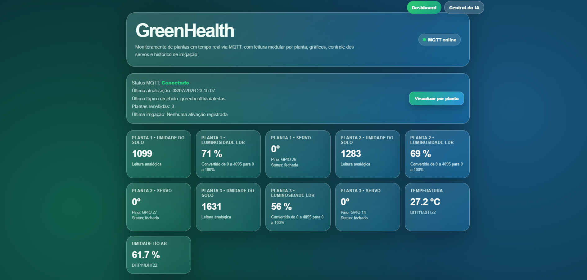
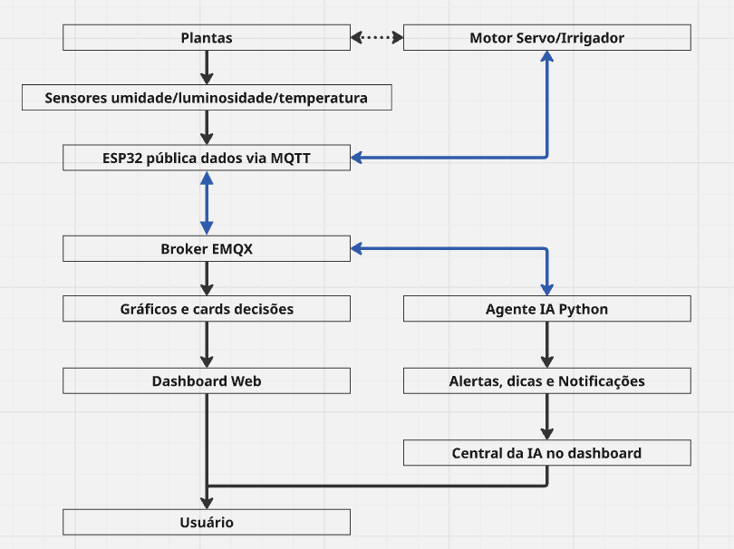
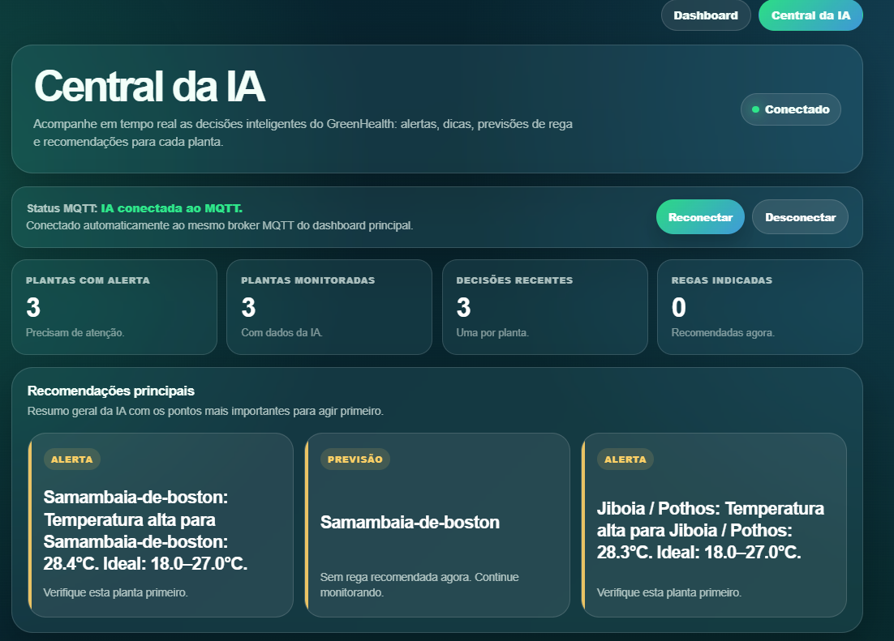
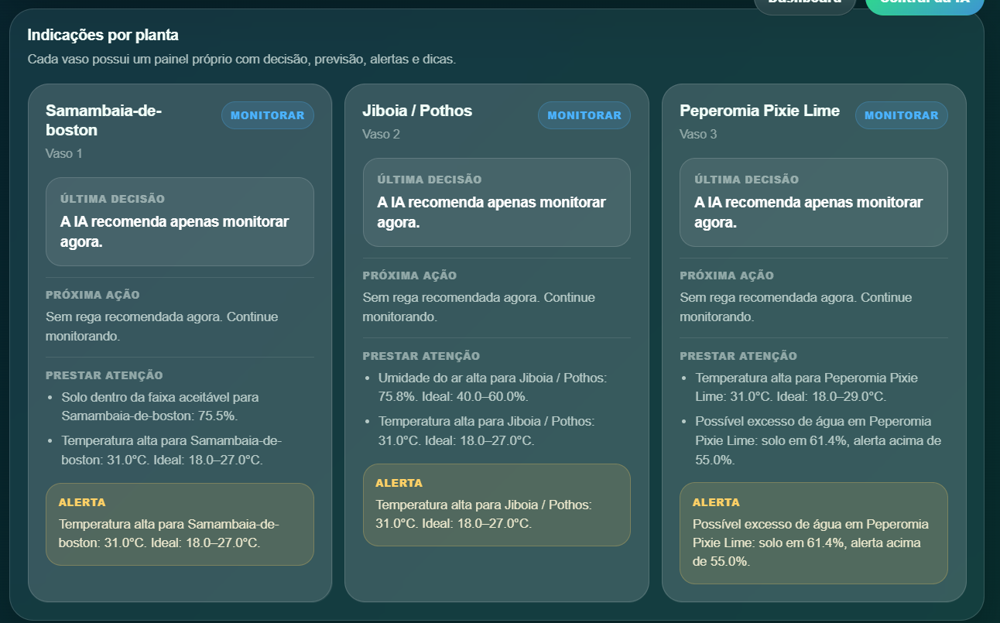
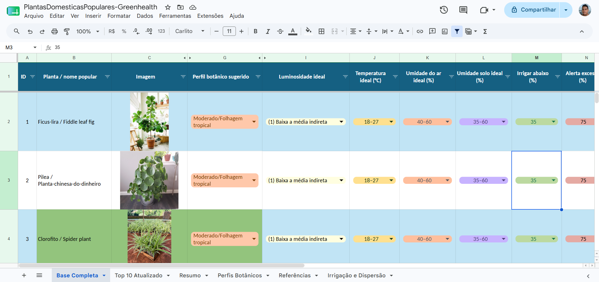
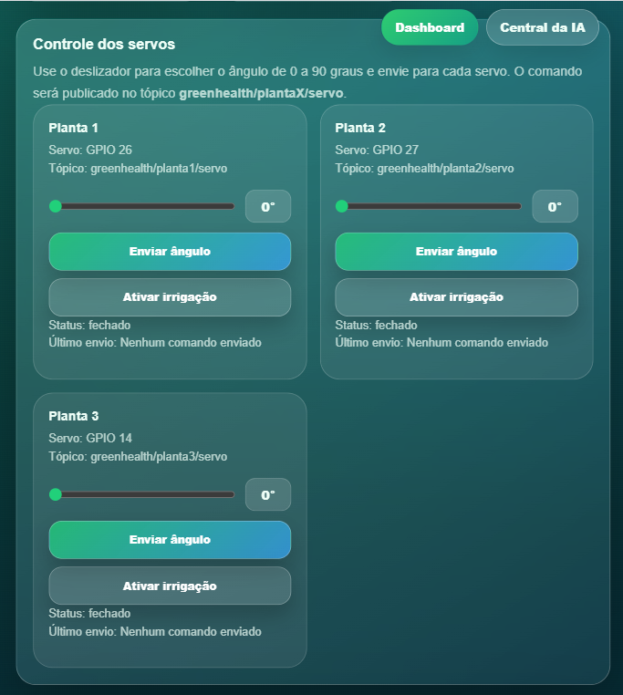
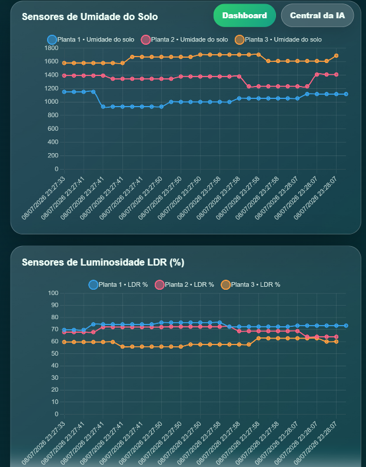
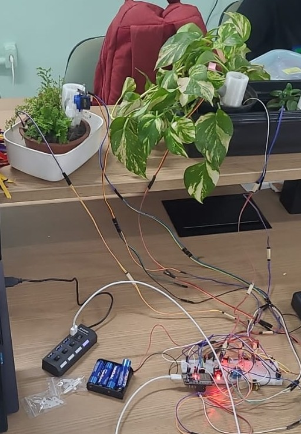

# 🌱 GreenHealth
<p align="center">
  
</p>


## Sumário

## Sumário

1. [🌿 Problema](#-problema)
2. [🎯 Objetivo do projeto](#-objetivo-do-projeto)
3. [🧠 Funcionamento geral](#-funcionamento-geral)
4. [🤖 Central da IA](#-central-da-ia)
5. [🌱 Perfis botânicos usados pela IA](#-perfis-botânicos-usados-pela-ia)
6. [🖥️ Dashboard web](#%EF%B8%8F-dashboard-web)
7. [🧰 Componentes usados](#-componentes-usados)
8. [🔌 Esquema de ligação atualizado](#-esquema-de-ligação-atualizado)
9. [🚦 LED RGB de status](#-led-rgb-de-status)
10. [📡 Comunicação MQTT](#-comunicação-mqtt)
11. [📤 Tópicos publicados pelo ESP32](#-tópicos-publicados-pelo-esp32)
12. [📥 Tópicos de comando dos servos](#-tópicos-de-comando-dos-servos)
13. [🤖 Tópicos da IA](#-tópicos-da-ia)
14. [🧠 Como a IA decide os alertas](#-como-a-ia-decide-os-alertas)
15. [🗃️ Node-RED e banco de dados](#️%EF%B8%8F-node-red-e-banco-de-dados)
16. [🚀 Como usar](#-como-usar)
17. [📌 Estado atual do projeto](#-estado-atual-do-projeto)
18. [🔮 Próximas melhorias](#-próximas-melhorias)
19. [👨‍💻 Autor](#%E2%80%8D-autor)
20. [📄 Licença](#-licença)
---

O **GreenHealth IoT** é um sistema inteligente para **monitoramento, análise e irrigação automatizada de plantas domésticas**, utilizando **ESP32**, sensores ambientais, comunicação **MQTT**, dashboard web e uma **central de IA local** baseada em perfis botânicos.

O projeto coleta dados reais das plantas, como umidade do solo, luminosidade, temperatura e umidade do ar, envia essas informações via MQTT e permite que o usuário acompanhe tudo em tempo real por meio de uma interface web. Além disso, um agente em Python analisa uma base com informações detalhadas de mais de 60 plantas e gera alertas, dicas e notificações para auxiliar no cuidado individualizado de cada espécie.


## 🌿 Problema

O cuidado com plantas domésticas geralmente é feito de forma manual e intuitiva. Isso dificulta o acompanhamento correto das condições de cada planta, principalmente quando espécies diferentes possuem necessidades distintas de água, luz, temperatura e umidade.

Entre os principais problemas estão:

- Falta de água;
- Excesso de água;
- Baixa ou alta luminosidade;
- Falta de acompanhamento da temperatura;
- Baixa umidade do ar;
- Dificuldade de saber quando regar;
- Falta de dados para apoiar decisões;
- Ausência de recomendações específicas para cada espécie.

Dessa forma, o projeto busca responder ao seguinte problema:

> Como utilizar IoT, automação e análise inteligente de perfis botânicos para monitorar plantas domésticas e auxiliar o usuário no cuidado individualizado de cada espécie?

---

## 🎯 Objetivo do projeto

Desenvolver o **GreenHealth IoT**, um sistema inteligente para monitoramento e irrigação automatizada de plantas domésticas, capaz de utilizar dados ambientais, leituras dos sensores e perfis botânicos para apoiar o cuidado individualizado, ampliar a autonomia da irrigação e permitir o acompanhamento remoto pelo usuário.

O sistema permite acompanhar:

- 💧 Umidade do solo;
- ☀️ Luminosidade;
- 🌡️ Temperatura do ambiente;
- 🌫️ Umidade do ar;
- 🕒 Data e hora das leituras;
- 📡 Status de conexão MQTT;
- 🚿 Estado dos servos de irrigação;
- 🤖 Alertas e recomendações da IA;
- 📊 Histórico e gráficos das leituras.

---

## 🧠 Funcionamento geral

O projeto é dividido em três partes principais:

1. **ESP32 com sensores e atuadores**  
   Responsável por ler os sensores das plantas, controlar os servos de irrigação e publicar os dados no MQTT.

2. **Dashboard Web**  
   Interface para visualizar os dados dos sensores em tempo real, acompanhar gráficos, status MQTT, histórico de irrigação e controlar os servos manualmente.

3. **Central da IA**  
   Código em Python que roda localmente, lê uma planilha com perfis botânicos e analisa os dados recebidos dos sensores para emitir alertas, dicas e recomendações.


<p align="center">
  
</p>
<p align="center">
  
</p>


---

## 🤖 Central da IA

A central da IA é um módulo local desenvolvido em **Python**. Ela analisa os dados enviados pelo ESP32 e compara essas leituras com uma base de conhecimento de perfis botânicos.

Essa base está em uma planilha `.csv` ou `.xlsx`, construída a partir de revisão bibliográfica com artigos, sites técnicos, extensões universitárias, blogs especializados e fontes populares sobre plantas domésticas.

A planilha contém informações como:

- Nome popular da planta;
- Nome científico;
- Família botânica;
- Perfil botânico sugerido;
- Características da espécie;
- Luminosidade ideal;
- Temperatura ideal;

Com essas informações, a IA consegue:

- Identificar se a planta está com pouca água;
- Alertar sobre excesso de umidade no solo;
- Indicar luminosidade insuficiente ou excessiva;
- Verificar se a temperatura está fora do ideal;
- Verificar se a umidade do ar está inadequada;
- Gerar recomendações específicas conforme o perfil botânico;
- Publicar alertas e dicas para a central da IA no dashboard;
- Opcionalmente, enviar comandos de irrigação automática.

<p align="center">
  
</p>
<p align="center">
  
</p>

---

## 🌱 Perfis botânicos usados pela IA

O agente de IA trabalha com um mapeamento entre os vasos físicos do ESP32 e os IDs da planilha de perfis botânicos.

Exemplo de configuração atual:

| Vaso físico no ESP32 | ID na planilha | Planta |
|---|---:|---|
| Planta 1 | 18 | Samambaia-de-boston |
| Planta 2 | 24 | Jiboia / Pothos |
| Planta 3 | 42 | Peperomia Pixie Lime |

Esse mapeamento permite que cada vaso seja analisado de forma individual. Assim, uma planta de perfil úmido, como a samambaia, não recebe a mesma recomendação de irrigação que uma planta mais resistente à seca.
<p align="center">
  
</p>

---

## 🖥️ Dashboard web

O dashboard web foi desenvolvido em **HTML, CSS e JavaScript** para exibir as informações do sistema em tempo real.

### Recursos do dashboard

- Cards com valores atuais dos sensores;
- Gráficos de linha em tempo real;
- Status de conexão MQTT;
- Visualização da umidade do solo;
- Visualização da luminosidade;
- Visualização da temperatura e umidade do ar;
- Histórico de irrigação;
- Controle manual dos servos;
- Slider de 0° a 90° para controle dos servos;
- Botão para enviar comandos de irrigação;
- Central da IA para alertas, dicas e notificações;
- Atualização automática dos dados via MQTT.

<p align="center">
  
</p>
<p align="center">
  
</p>
<p align="center">
  
</p>

<br>

<em>Dashboard de monitoramento dos sensores em tempo real utilizando MQTT.</em>

---

## 🧰 Componentes usados

### 🔌 Hardware

- ESP32;
- Sensores de umidade do solo;
- Sensores LDR para luminosidade;
- Sensor DHT11 para temperatura e umidade do ar;
- RTC DS3231;
- Microservos para controle de irrigação;
- LED RGB para indicação de status;
- Jumpers;
- Protoboard;
- Cabo USB ou fonte de alimentação.

### 💻 Software e tecnologias

- Arduino IDE;
- HTML;
- CSS;
- JavaScript;
- Python;
- Pandas;
- OpenPyXL;
- Paho MQTT;
- MQTT;
- Broker EMQX;
- PubSubClient;
- ESP32Servo;
- DHT sensor library;
- RTClib;
- Node-RED;
- SQLite;
- Chart.js.

---

## 🔌 Esquema de ligação atualizado

### Sensores, RTC, LED e servos

| Componente | Pino no ESP32 | Observação |
|---|---:|---|
| DHT11 | GPIO 5 | Temperatura e umidade do ar |
| RTC DS3231 SDA | GPIO 19 | Comunicação I2C |
| RTC DS3231 SCL | GPIO 21 | Comunicação I2C |
| LED RGB - Vermelho | GPIO 16 | Status do sistema |
| LED RGB - Verde | GPIO 17 | Status do sistema |
| LED RGB - Azul | GPIO 18 | Status do sistema |
| Planta 1 - LDR | GPIO 33 | Entrada analógica |
| Planta 1 - Umidade do solo | GPIO 35 | Entrada analógica, apenas entrada |
| Planta 1 - Servo | GPIO 26 | Saída PWM para irrigação |
| Planta 2 - LDR | GPIO 36 | Entrada analógica, apenas entrada |
| Planta 2 - Umidade do solo | GPIO 34 | Entrada analógica, apenas entrada |
| Planta 2 - Servo | GPIO 27 | Saída PWM para irrigação |

> ⚠️ Os pinos **GPIO 34, 35, 36 e 39** do ESP32 são apenas entrada. Eles podem ser usados para sensores, mas não devem ser usados como saída para LED, servo, relé ou qualquer atuador.


<p align="center">
  
</p>

<br>

<em>Protótipo físico com ESP32, sensores e atuadores utilizados no monitoramento das plantas.</em>

---

## 🚦 LED RGB de status

O LED RGB indica visualmente o estado do sistema:

| Cor | Significado |
|---|---|
| 🔴 Vermelho | MQTT desconectado |
| 🟢 Verde | Sistema conectado e sensores funcionando |
| 🟡 Amarelo | Sensor com erro ou leitura inválida |
| 🔵 Azul | Servo em movimento ou irrigação em execução |

---

## 📡 Comunicação MQTT

O projeto utiliza o protocolo **MQTT** para comunicação entre ESP32, dashboard web, Node-RED e agente de IA.

### Broker

| Item | Valor |
|---|---|
| Broker MQTT | `broker.emqx.io` |
| Porta MQTT ESP32/Python/Node-RED | `1883` |
| Porta WebSocket do dashboard | `8084` |

---

## 📤 Tópicos publicados pelo ESP32

| Tópico | Função |
|---|---|
| `greenhealth/sensores/temperatura` | Temperatura do ar |
| `greenhealth/sensores/umidade_ar` | Umidade do ar |
| `greenhealth/sensores/data_hora` | Data e hora da leitura |
| `greenhealth/sensores/dados` | JSON completo com todos os sensores |

### Exemplo de JSON publicado

```json
{
  "temperatura": 28.5,
  "umidade_ar": 70,
  "data_hora": "11/06/2026 18:30:00",
  "plantas": [
    {
      "planta": 1,
      "ldr": 2200,
      "luminosidade": 53.72,
      "umidade_solo": 42,
      "servo": 0
    },
    {
      "planta": 2,
      "ldr": 1800,
      "luminosidade": 43.95,
      "umidade_solo": 57,
      "servo": 0
    }
  ]
}
```

---

## 📥 Tópicos de comando dos servos

O ESP32 escuta comandos de servo no seguinte padrão:

```txt
greenhealth/planta1/servo
greenhealth/planta2/servo
greenhealth/planta3/servo
```

Comandos aceitos:

| Mensagem | Ação |
|---|---|
| `ativar` | Abre o servo, aguarda o tempo configurado e fecha |
| `regar` | Mesmo comportamento de `ativar` |
| `1` | Mesmo comportamento de `ativar` |
| `abrir` | Abre o servo |
| `fechar` | Fecha o servo |
| `0` a `90` | Move o servo para o ângulo informado |

### Tópicos de retorno dos servos

| Tópico | Função |
|---|---|
| `greenhealth/planta1/servo/status` | Status do servo da Planta 1 |
| `greenhealth/planta1/servo/angulo` | Ângulo atual do servo da Planta 1 |
| `greenhealth/planta2/servo/status` | Status do servo da Planta 2 |
| `greenhealth/planta2/servo/angulo` | Ângulo atual do servo da Planta 2 |

---

## 🤖 Tópicos da IA

O agente de IA em Python escuta os dados dos sensores e publica alertas, dicas e decisões em tópicos próprios.

| Tópico | Função |
|---|---|
| `greenhealth/sensores/dados` | Entrada de dados para análise da IA |
| `greenhealth/ia/status` | Status do agente de IA |
| `greenhealth/ia/alertas` | Alertas de cuidado com as plantas |
| `greenhealth/ia/dicas` | Dicas e recomendações |
| `greenhealth/ia/decisoes` | Decisões tomadas pela IA |

> ⚠️ Observação importante: no código Python atual, o tópico base dos comandos automáticos de servo está configurado como `greenhealth/atuadores`. Já o ESP32 escuta `greenhealth/+/servo`, como `greenhealth/planta1/servo`. Para irrigação automática funcionar diretamente, os tópicos precisam estar alinhados. Uma solução simples é ajustar o Python para publicar em `greenhealth/planta1/servo`, `greenhealth/planta2/servo` e assim por diante.

---

## 🧠 Como a IA decide os alertas

A IA analisa cada planta com base em:

- Umidade do solo medida;
- Limite mínimo de irrigação da espécie;
- Limite de excesso de água;
- Faixa ideal de luminosidade;
- Faixa ideal de temperatura;
- Faixa ideal de umidade do ar;
- Frequência aproximada de rega;
- Última irrigação registrada;
- Perfil botânico da planta.

Exemplo de decisão:

```txt
Se a Planta 1 for uma Samambaia-de-boston:
- Umidade ideal do solo: 55% a 75%
- Irrigar abaixo de: 50%
- Alerta de excesso: acima de 85%

Se o sensor indicar 38%:
→ A IA gera alerta de baixa umidade
→ A IA recomenda irrigação
→ A central da IA exibe a notificação no dashboard
```

---

## 🗃️ Node-RED e banco de dados

O projeto também possui integração com **Node-RED** para receber os dados MQTT e armazenar as leituras em banco local.

O banco utilizado é um arquivo SQLite localizado em:

```txt
Database/greenhealth.db
```

Exemplo de caminho local usado no desenvolvimento:

```txt
C:\Users\samue\OneDrive\Documentos\GitHub\GreenHealth - IOT\Database\greenhealth.db
```

O Node-RED pode ser usado para:

- Receber mensagens MQTT;
- Tratar os dados dos sensores;
- Salvar histórico no banco SQLite;
- Gerar base para gráficos históricos;
- Integrar os dados com outras automações futuras.


## 🚀 Como usar

### 1. Clonar o repositório

```bash
git clone https://github.com/samueldesaa/greenhealth-iot.git
```

### 2. Abrir o código do ESP32

Abra o arquivo na Arduino IDE:

```txt
Esp32-Codes/Teste3SensoresHumLDR/Teste3SensoresHumLDR.ino
```

### 3. Instalar as bibliotecas do Arduino

Na Arduino IDE, instale:

- WiFi;
- PubSubClient;
- ESP32Servo;
- DHT sensor library;
- RTClib.

### 4. Configurar Wi-Fi

No código do ESP32, altere os dados da rede:

```cpp
const char* WIFI_SSID = "NOME_DA_REDE";
const char* WIFI_PASSWORD = "SENHA_DA_REDE";
```

### 5. Conferir broker MQTT

```cpp
const char* MQTT_BROKER = "broker.emqx.io";
const int MQTT_PORT = 1883;
```

### 6. Montar o circuito

Monte os sensores, RTC, LED RGB e servos seguindo a tabela de conexões deste README.

### 7. Enviar o código para o ESP32

Na Arduino IDE:

1. Selecione a placa ESP32 correta;
2. Escolha a porta COM correspondente;
3. Clique em **Upload**;
4. Abra o **Monitor Serial** para verificar Wi-Fi, MQTT, RTC, sensores e servos.

### 8. Abrir o dashboard

Abra o arquivo:

```txt
Dashboard/index.html
```

Ou publique a pasta em uma plataforma como:

- GitHub Pages;
- Vercel;
- Netlify.

### 9. Rodar a IA local

Instale as dependências:

```bash
pip install paho-mqtt pandas openpyxl
```

Depois execute:

```bash
python IAPython/AgenteIA.py
```

A planilha de perfis deve estar em:

```txt
IAPython/perfis_plantas.csv
```

---

## 📌 Estado atual do projeto

| Módulo | Status |
|---|---|
| Repositório criado | ✅ Concluído |
| Código do ESP32 | ✅ Implementado |
| Leitura de sensores | ✅ Implementado |
| Envio de dados por MQTT | ✅ Implementado |
| Dashboard web | ✅ Implementado |
| Exibição de gráficos | ✅ Implementado |
| Status de conexão MQTT | ✅ Implementado |
| RTC DS3231 | ✅ Implementado |
| LED RGB de status | ✅ Implementado |
| Controle manual dos servos | ✅ Implementado |
| Histórico de irrigação no dashboard | ✅ Implementado |
| Central da IA | ✅ Implementado |
| Planilha de perfis botânicos | ✅ Implementado |
| Agente Python com análise local | ✅ Implementado |
| Node-RED para salvar dados | ✅ Implementado |
| Banco SQLite local | ✅ Implementado |
| Irrigação automática via IA | ⚠️ Parcial, depende de alinhar tópicos |
| Calibração final dos sensores | 🔜 A ajustar |
| Testes prolongados com plantas reais | 🔜 A realizar |

---

## 🔮 Próximas melhorias

Para as próximas etapas do projeto, espera-se implementar:

- Ajuste final dos tópicos entre IA e ESP32 para irrigação automática;
- Calibração individual dos sensores de umidade do solo;
- Calibração dos LDRs conforme o ambiente real;
- Melhorias na central da IA;
- Alertas por WhatsApp, Telegram ou e-mail;
- Histórico completo de decisões da IA;
- Painel de comparação entre plantas;
- Cadastro dinâmico de plantas pelo dashboard;
- Integração mais avançada com Node-RED;
- Testes com diferentes espécies em ambiente doméstico;
- Melhorias no sistema físico de gotejamento com servos;
- Fonte externa mais estável para alimentar os servos.


## 👨‍💻 Autor

Desenvolvido por **Samuel Chaves de Sá**.

Projeto acadêmico desenvolvido no curso de **Sistemas de Informação**, com foco em **IoT**.

---

## 📄 Licença

Este projeto possui licença restritiva de uso.

O código, a documentação, a interface, os diagramas e demais arquivos estão protegidos por direitos autorais e pertencem a **Samuel Chaves de Sá**.

É permitido visualizar este repositório apenas para fins de avaliação acadêmica, estudo pessoal e consulta.

Não é permitido copiar, redistribuir, modificar, publicar versões derivadas ou utilizar este projeto para fins comerciais sem autorização prévia do autor.

Consulte o arquivo [LICENSE](LICENSE) para mais detalhes.
